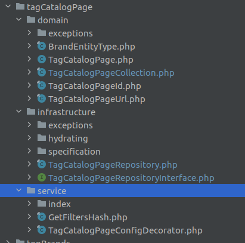
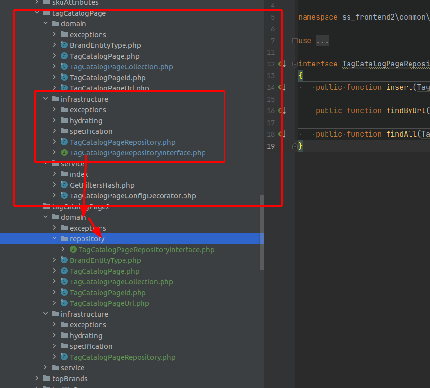
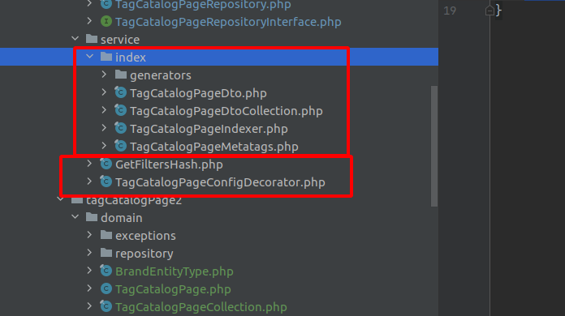
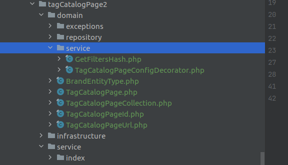

Итак, можете подсказать, правильно ли то, что будет ниже:

1) была вот такая структура файлов:

   
далее, из того, что я узнал о DDD + hex arch, 
## Шаг 1, перенос портов под БД
что отчасти структура файлов неверна, потому что нет портов(точнее порты есть, но не на своём месте)
Мой вариант, как по идее должно было бы быть:

здесь я делаю чистый порт внутри domain/repository

соответственно ok/infrastructure/XXX-repository - теперь полноценный адаптер, верно?   

### Подвопрос: 
для метода `public function findAll(TagCatalogPageSpecification $specification): TagCatalogPageCollection;`
мне нужна спецификация. Она - не часть домена, и её(тут да/нет от вас) ни в коем случае нельзя парковать в ok/domain/infrastructure
рядом с портом.  
Всё зависит от абстракций, но как тут правильно разобратся с портом.

P.S на ум пришло только сделать XXX_SpecificationInterface - но почему то мне эта идея кажется дико неправильной(хотя, с другой 
стороны зависимость же, да, и на тестах её будет легко перебить)

## 2. Перенос сервиса
Из книги вернома знаю, что сервисов есть 2 вида: domain и application. Domain - делают какую-то доменную логику, которую
было бы неудобно/трудно/нецелесообразно писать в сущности. Application - более общая логика, которая может затрагивать не 
только домен.

С тех сервисов, что у нас есть, я вижу, что есть чёткое разделение их на 2 группы:, 
индексатор - application сервисы, и, они соответственно сейчас нахоодятся верно в `ok/services`, 
а `GetHash` и декоратор - domainService, потому что они исполняют чисто доменную логику, и их нужно было бы перенести вот так, верно?

Собственно, пока только 4 вопроса:
* правильно ли я вынес в примере порт БД
* как бы вы посоветовали сделать со спецификацией
* правильно ли получилось разделение сервисов
* и в общем и целом, моё распределение кода раньше было неправильным 
  
И с учетом текущей статьи, и что я могу ещё поправить в своей работе?

